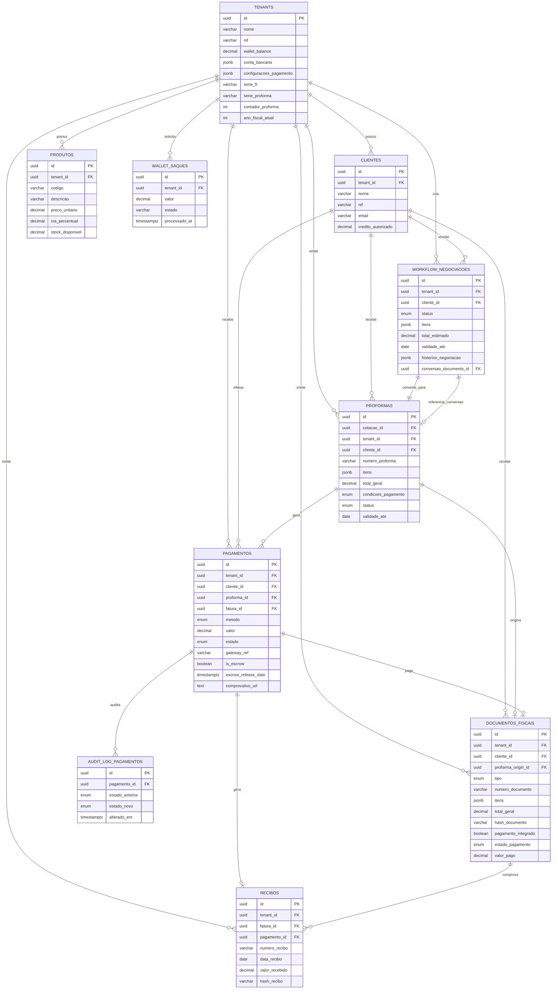
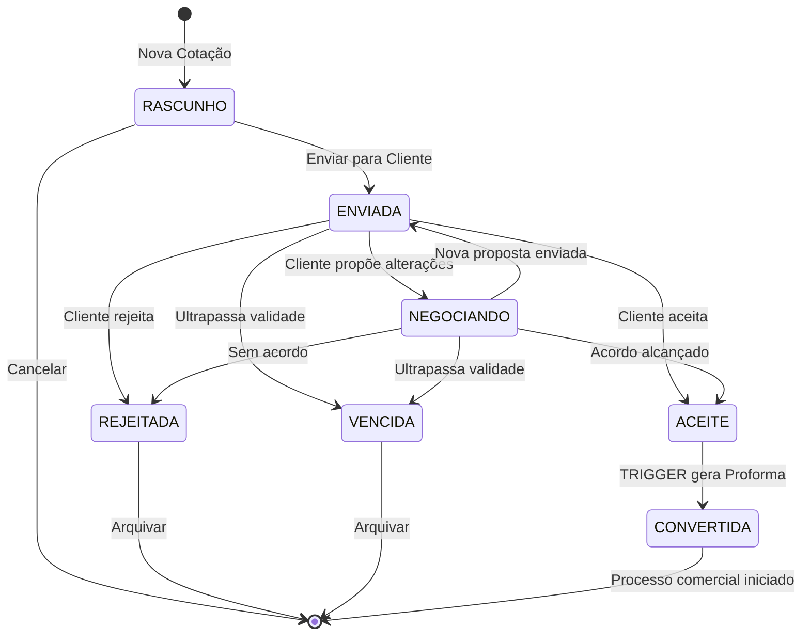
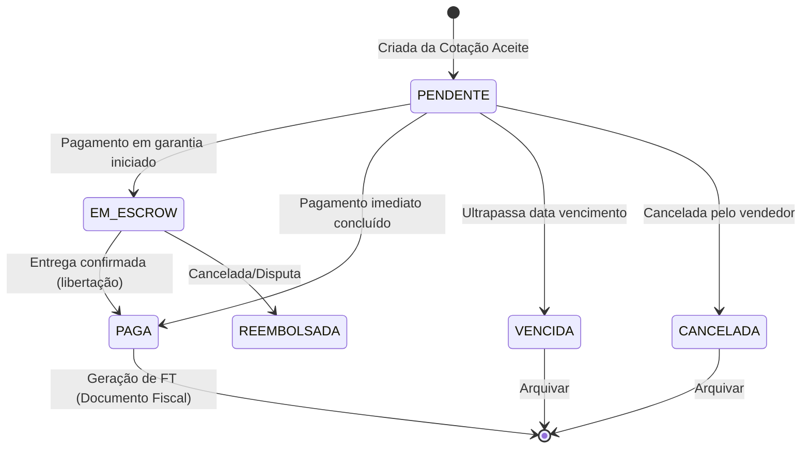
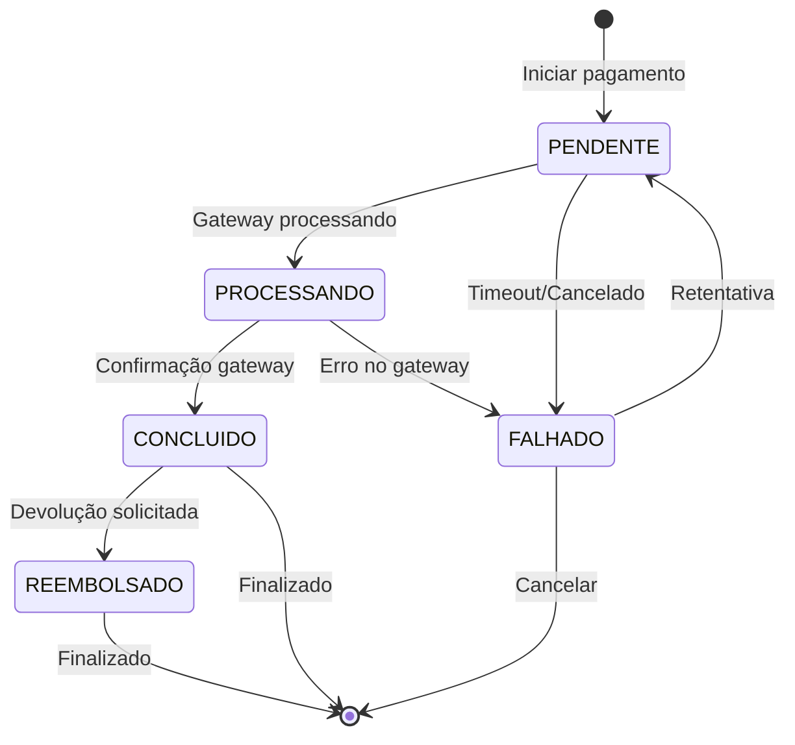
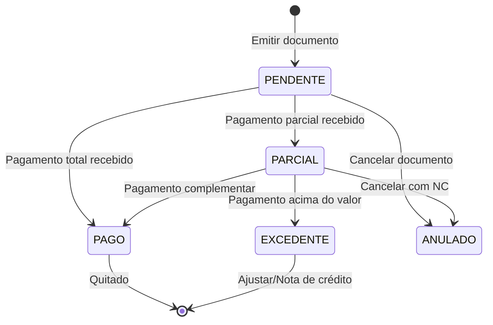
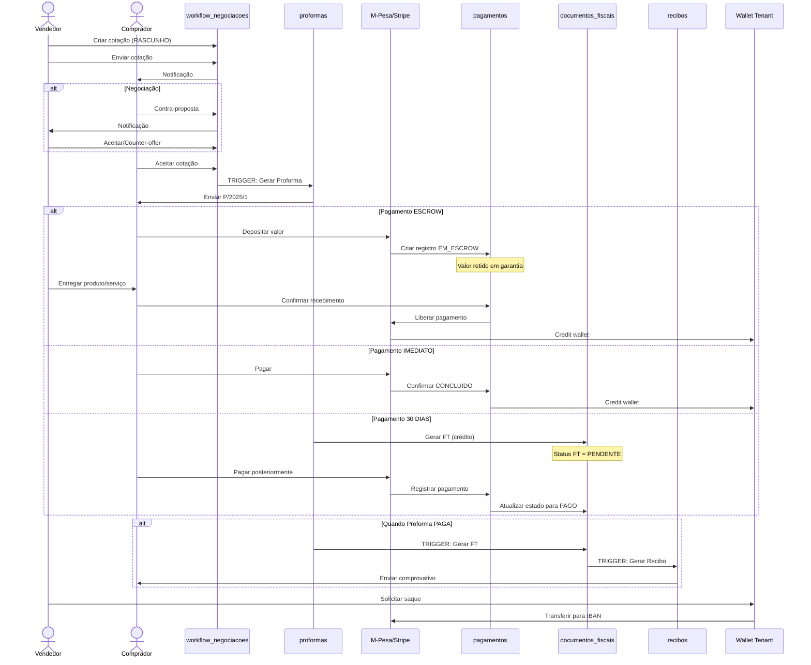
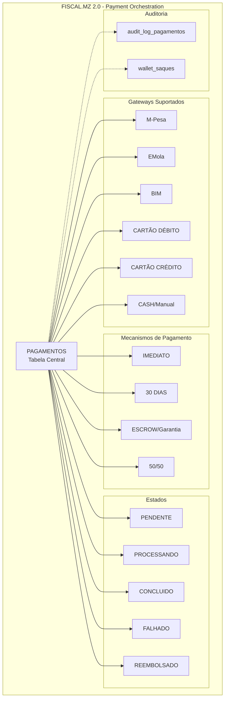

# FISCAL.MZ 2.0 - Diagramas de Arquitetura

## 1. Diagrama ER - Workflow Comercial → Fiscal



---

## 2. State Machine - Workflow de Negociação (Cotação)



### Descrição dos Estados:

| Estado | Descrição | Ações Permitidas |
|--------|-----------|------------------|
| **RASCUNHO** | Cotação em elaboração pelo vendedor | Editar itens, preços; Enviar para cliente; Cancelar |
| **ENVIADA** | Cotação enviada ao cliente para análise | Aguardar resposta; Não editável pelo vendedor |
| **NEGOCIANDO** | Cliente propôs contra-proposta | Responder cliente; Aceitar/rejeitar contra-proposta |
| **ACEITE** | Cliente aceitou termos | Trigger automático gera proforma |
| **REJEITADA** | Cliente recusou a cotação | Arquivar; Criar nova versão |
| **CONVERTIDA** | Transformada em proforma | Read-only; Referência para documento gerado |
| **VENCIDA** | Ultrapassou data de validade | Renovar; Arquivar |

---

## 3. State Machine - Proforma (Documento Comercial)



---

## 4. State Machine - Pagamento (Payment Orchestration)



---

## 5. State Machine - Documento Fiscal (FT/FR)



---

## 6. Fluxo Completo - B2B Marketplace



---

## 7. Diferença: Documentos Comerciais vs Fiscais

```mermaid
graph TB
    subgraph "DOCUMENTOS COMERCIAIS<br/>(Negociáveis / Não-fiscais)"
        C[COTAÇÃO<br/>workflow_negociacoes]
        P[PROFORMA<br/>proformas]
        
        C -->|Aceite| P
        
        note1[Características:<br/>• Sem hash fiscal<br/>• Sem QR code<br/>• Sem série oficial<br/>• Negociáveis<br/>• Podem ser canceladas<br/>• Não têm valor fiscal]
    end
    
    subgraph "DOCUMENTOS FISCAIS<br/>(Imutáveis / Oficiais)"
        FT[FATURA<br/>documentos_fiscais]
        FR[FATURA-RECIBO<br/>documentos_fiscais]
        NC[NOTA DE CRÉDITO<br/>documentos_fiscais]
        ND[NOTA DE DÉBITO<br/>documentos_fiscais]
        R[RECIBO<br/>recibos]
        
        note2[Características:<br/>• Hash SHA256<br/>• QR Code obrigatório<br/>• Série oficial (FT/FR/NC/ND/R)<br/>• Imutáveis após emissão<br/>• Anulação via NC<br/>• Valor fiscal/legal]
        
        FT -.->|Cancelamento| NC
        FT -.->|Acerto| ND
        FT -.->|Pagamento| R
    end
    
    P -->|Quando paga| FT
    P -->|Quando paga| FR
```

---

## 8. Diagrama de Componentes - Payment Orchestration


